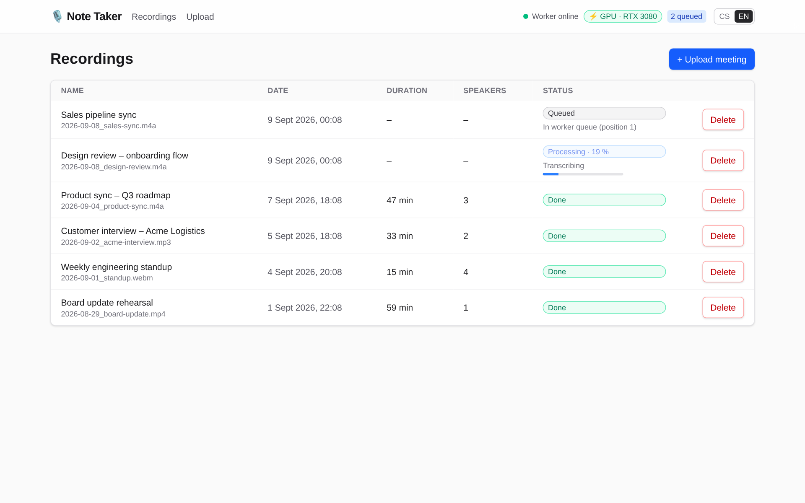
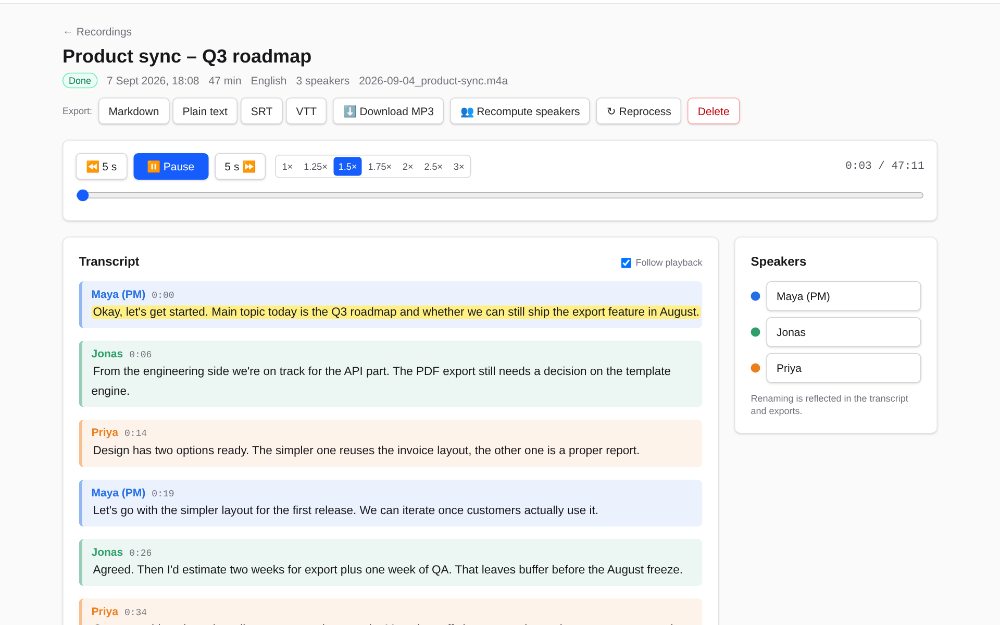
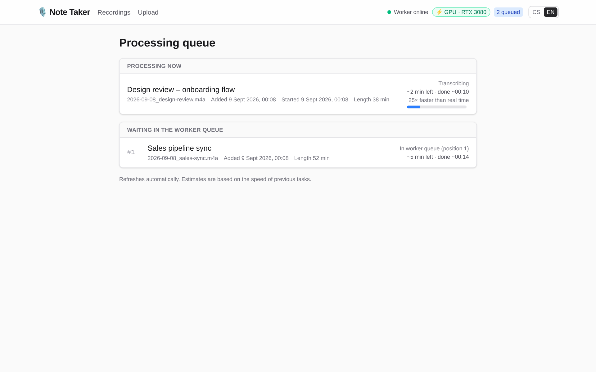
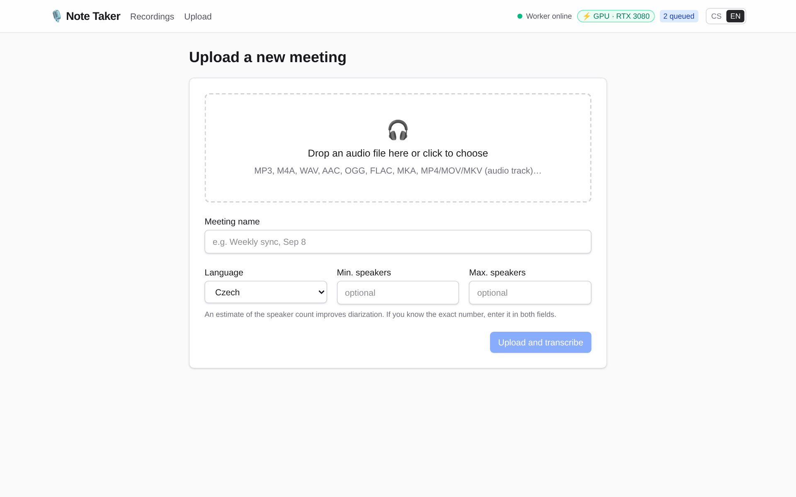

# Note Taker – meeting transcription with speaker diarization

Monorepo with two independently deployable services:

| Service | Path | Stack | Runs on |
| --- | --- | --- | --- |
| **Worker** (GPU transcription) | [`apps/worker`](apps/worker) | Python, FastAPI, WhisperX (faster-whisper/CTranslate2), pyannote diarization, ffmpeg | local PC with an NVIDIA GPU (WSL2) |
| **Web** (UI + gateway) | [`apps/web`](apps/web) | Next.js 16 (App Router), Drizzle ORM + SQLite, Tailwind | homelab, in Docker |
| Shared types | [`packages/shared`](packages/shared) | TypeScript types for the API contract | – |

```
┌──────────────┐  upload   ┌────────────────────┐  POST /transcribe   ┌────────────────────────┐
│   Browser    │ ────────▶ │  apps/web (Docker) │ ──────────────────▶ │  apps/worker (WSL2/GPU) │
│              │ ◀──────── │  SQLite + files    │ ◀────────────────── │  ffmpeg → WhisperX →    │
└──────────────┘  polling  │  poller every 3 s  │  status / result    │  pyannote               │
                           └────────────────────┘                     └────────────────────────┘
```

Flow: the user uploads a file to the web app → the web app stores it and forwards it to the worker →
the web app polls the task state (`QUEUED → CONVERTING → TRANSCRIBING → DIARIZING → COMPLETED`) →
on completion it downloads the result and the normalized audio and stores both locally. The worker
may be offline: the recording stays "queued" and the web app hands it over as soon as the worker is
reachable again.

## Screenshots

Sample data shown below is fictional.

| Recordings overview | Recording detail |
| --- | --- |
|  |  |

| Processing queue | Upload |
| --- | --- |
|  |  |

## Quick start

### 1. Worker (Windows + WSL2 + NVIDIA GPU)

```bash
cd apps/worker
bash setup-wsl.sh          # creates .venv (uv or python -m venv), installs torch+CUDA and WhisperX
cp .env.example .env       # set HF_TOKEN (diarization), optionally WORKER_API_KEY
bash run.sh                # http://0.0.0.0:8000 – Swagger UI at /docs
```

Details (HF token, reaching WSL2 from another machine, model choice): [`apps/worker/README.md`](apps/worker/README.md).

### 2. Web (homelab, Docker)

```bash
cd apps/web
cp .env.example .env       # WORKER_API_URL=http://<worker-pc-ip>:8000, WORKER_API_KEY
docker compose up -d --build
```

The UI is served on `http://<homelab>:3000`; data (SQLite + audio) lives in `apps/web/data/`.

### 3. Everything on one machine (Docker + NVIDIA Container Toolkit)

```bash
cp apps/worker/.env.example apps/worker/.env   # HF_TOKEN
docker compose -f docker-compose.all.yml up -d --build
```

### Development

```bash
pnpm install
pnpm dev:worker            # = bash apps/worker/run.sh
pnpm dev:web               # Next.js dev server on :3000 (WORKER_API_URL from apps/web/.env)
pnpm typecheck
```

## Layout

```
apps/
  worker/            FastAPI + WhisperX; setup-wsl.sh, run.sh, Dockerfile
    worker/main.py     REST endpoints (/transcribe, /tasks/{id}/status|result|audio, /health)
    worker/queue.py    sequential GPU queue (one task at a time, persisted under data/tasks)
    worker/pipeline.py WhisperX transcribe → align → pyannote diarize
    worker/audio.py    ffmpeg normalization (16 kHz mono MP3) + ffprobe
  web/               Next.js App Router; Dockerfile, docker-compose.yml
    src/app/           pages (/ list, /upload, /recordings/[id]) + API routes
    src/lib/           db (Drizzle/SQLite), worker-client, recordings (orchestration), poller, export
    src/components/    RecordingList, UploadForm, RecordingView (player + transcript), …
packages/
  shared/            TypeScript API types (WorkerTaskStatus, TranscriptSegment, …)
docker-compose.all.yml
```

## Worker API

| Method | Path | Description |
| --- | --- | --- |
| `POST` | `/transcribe` | multipart `file` + optional `language`, `min_speakers`, `max_speakers` → `{task_id, status, queue_position}` (202) |
| `GET` | `/tasks/{id}/status` | `status` (`QUEUED/CONVERTING/TRANSCRIBING/DIARIZING/COMPLETED/FAILED`), `progress` 0–100, `phase`, `queue_position`, `error` |
| `GET` | `/tasks/{id}/result` | JSON with `segments[]` (`start`, `end`, `speaker`, `text`, `words[]`), `speakers[]`, `language`, `duration`, `audio_url` (202 until finished) |
| `GET` | `/tasks/{id}/audio` | normalized audio (16 kHz mono MP3) |
| `DELETE` | `/tasks/{id}` | removes the task and its files |
| `GET` | `/health` | CUDA availability, GPU name, VRAM, queue length, loaded model |

When `WORKER_API_KEY` is set, every endpoint except `/health` requires the `X-API-Key` header.
