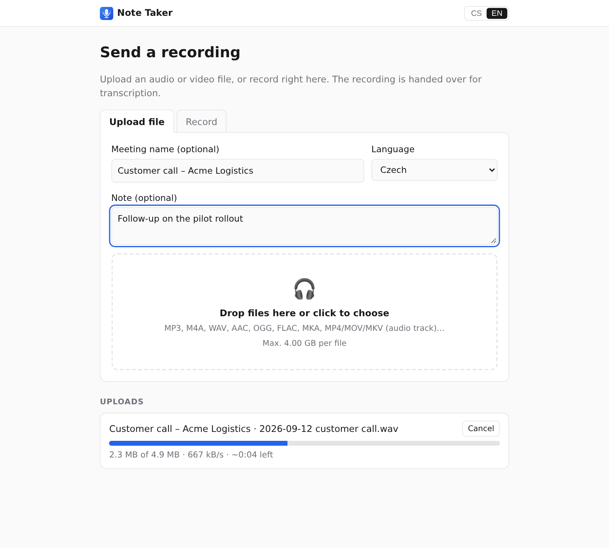

# apps/intake – public upload page

A deliberately small service you can expose to the internet so people can **send recordings** (upload a file or
record in the browser) without getting any access to the Note Taker system itself.

```
 Internet                                   │  LAN (not reachable from outside)
                                            │
 uploader ──HTTPS──▶ intake (this app)      │     web app ──▶ worker (GPU)
                     holds files until      │       │
                     they are collected  ◀──┼───────┘  outbound pull with a bearer token
```



**What the intake knows:** only files that were uploaded and not yet collected. It has no database, no address of
the internal system, and never opens a connection itself. After the web app downloads a file and verifies its
SHA-256, it acknowledges the item and the intake deletes it.

**What an uploader can see:** the upload page, the size limit, whether an access code is required, and the
progress of their own upload. Nothing about other uploads, the number of recordings, transcripts or GPU status.

## Run

```bash
cd apps/intake
cp .env.example .env
# INTAKE_COLLECT_TOKEN=$(openssl rand -hex 32)
# INTAKE_UPLOAD_CODE=optional-shared-code
docker compose up -d --build
```

Put it behind a TLS-terminating reverse proxy (Caddy, Traefik, Cloudflare Tunnel). Set `TRUST_PROXY=1` so the
per-IP limits see the client address. Browsers only allow microphone and tab capture on HTTPS.

On the internal web app (`apps/web/.env`):

```bash
INTAKE_URL=https://upload.example.com
INTAKE_TOKEN=<same value as INTAKE_COLLECT_TOKEN>
```

The web app checks every `INTAKE_POLL_SECONDS` (default 30). Recordings arrive tagged `intake`, with the uploader's
title and note; the note also carries the intake reference code shown to the uploader. Status and a
"Collect now" button are in Settings.

Without Docker: `node server.mjs` (Node 20+, no `npm install` needed).

## Hardening options

- **Access code** (`INTAKE_UPLOAD_CODE`): required for every API call. Share a link with `?code=…`; the page stores
  it and removes it from the address bar. Wrong attempts are rate limited.
- **Separate collector port** (`COLLECT_PORT`, `COLLECT_HOST`): the collector API is then not served on the public
  port at all; bind it to a VPN or firewall-restricted interface.
- **Limits**: per-file size, total pending storage, uploads per IP per hour, 8 MB chunks.
- **Retention**: unfinished uploads are removed after `UPLOAD_TTL_HOURS`, uncollected ones after `READY_TTL_DAYS`.
- The container runs read-only as a non-root user with all capabilities dropped; the page ships a strict CSP
  (same-origin only, no inline scripts).

## API

Public (all calls send `X-Upload-Code` when a code is configured):

| Method | Path | |
| --- | --- | --- |
| `GET` | `/api/config` | title, limits, `codeRequired` |
| `POST` | `/api/code` | 204 when the code is right |
| `POST` | `/api/uploads` | `{ filename, size, mime, title?, note?, language? }` → `{ id, chunkBytes }` |
| `PUT` | `/api/uploads/:id?offset=N` | raw bytes of one chunk; 409 with `{ received }` if the offset is stale |
| `GET` | `/api/uploads/:id` | `{ received }` to resume an interrupted upload |
| `POST` | `/api/uploads/:id/complete` | → `{ reference }` |
| `DELETE` | `/api/uploads/:id` | cancel |

Collector (`Authorization: Bearer <INTAKE_COLLECT_TOKEN>`):

| Method | Path | |
| --- | --- | --- |
| `GET` | `/collect/v1/items` | completed uploads with metadata and `sha256` |
| `GET` | `/collect/v1/items/:id/file` | file bytes |
| `DELETE` | `/collect/v1/items/:id` | acknowledge, deletes the item |
| `GET` | `/collect/v1/status` | counts and bytes pending |

## Tests

```bash
node --test "test/*.test.mjs"
```
